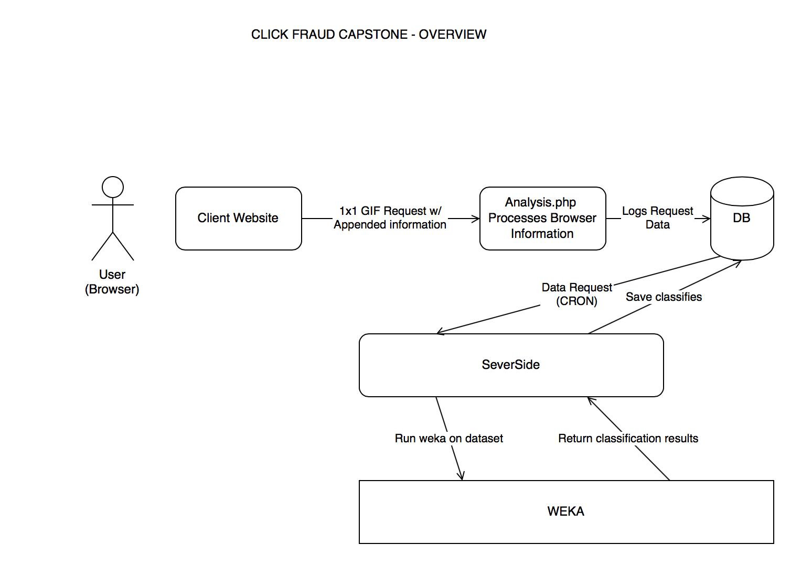

click-fraud-capstone
====================

### Project repository for Click-Fraud Analytics Capstone

## Table of Contents
1. [Project Overview](#project-overview)
  * [Project Phase](#project-phase)
  * [TODO](#todo)
  * [Contacts](#contacts)
  * [Frameworks Used](#frameworks-used)
  * [External Links](#external-links)
  * [Staging and Production Enviroments](#staging-and-production-enviroments)
2. [Documentation](#documentation)
  * [System overview](#system-overview)

## Project Overview
A web analytics platform to detect click fraud and track user activity. Our solution will allow organizations 
to review how well their advertising budget is being utilized and save them money on future advertising. By detecting click-fraud,
our solution will allow organizations to better utilize their advertising budgets and target real consumers more efficiently.

### Project Phase
* JAVASCRIPT CLIENT CODE
	- BROWSER INFORMATION
	- VISIT DEPTH
	- VISIT LENGHT (IN TIME UNITS)

* PHP DATABASE WRAPPER
	- ACCEPT HTTP REQUEST (request from client JS)
	- LOG INTO DATABASE 
	
* SALE SIDE
	- BOOTSTRAP WEBSITE
	- CLIENT LOG IN
	- GENERATE A CLIENT ID

* MACHINE LEARNING / C code WEKA 3
	- RETRIEVE INFORMATION FROM THE DATABASE
	- FORMAT DATA INTO WEKA 3 FORMAT
	- INPUT INTO WEKA 3

###TODO
* Understand Weka 3
 - ~~Use example databasets contained in [UCI ML Repository](http://archive.ics.uci.edu/ml/) 
 to better understand [Weka 3 - Data Mining Software in Java](http://www.cs.waikato.ac.nz/ml/weka/).~~
 - Client Page
   * Add a dashboard page, after user is logged in.
   * Display information from the database (we can have it display as a table for now).
 - Machine Learning (client code to call weka & browser info retrieval)
   * Make sure the features we can are being pushed to the database
   * Retreive features from the database and format into a weka accepted format
   * Use Weka API on the formatted data
   * Insert results back into the database.
  - Database
  * Must include: Client Information, Website Information, Click information,...
  * We need to discuss the achitecture.

### Contacts
*Project Members:*   
- Bryden Basaran 
- Everton Lima 
- Ray McMaster

*Project Advisor:* 
- Dr. Mohammad Al Hasan

### Frameworks Used
- [Bootstrap](https://github.com/twbs/bootstrap)

### External Links 
- [IU Box](https://iu.box.com/s/gcdnmju6k48psy6f6w5h)
  *Project documents (not code).
- [Project Calendar](http://www.google.com/calendar/embed?src=krimzun.com_9q19bvjt1tr2qccdjo104849jc%40group.calendar.google.com&ctz=America/New_York)
- [HTTP Header Fields](http://en.wikipedia.org/wiki/List_of_HTTP_header_fields)
  * This is important to keep in mind, as we can easily get this data from php, and make use of it in our learning algorithm.
- [XMLHttpRequest](http://www.w3schools.com/dom/dom_http.asp)
  * Javascript object that can take care of the server communication request for us.
- [UCI ML Repository](http://archive.ics.uci.edu/ml/) 
  * Example of datasets.
- [Weka 3 - Data Mining Software in Java](http://www.cs.waikato.ac.nz/ml/weka/).
  * Software that does the number crunching for us.
  * [Very good weka tutorial on classification](http://machinelearningmastery.com/how-to-run-your-first-classifier-in-weka/)
  * [Data Format for Weka](http://www.cs.waikato.ac.nz/ml/weka/arff.html)
- [FINGERPRINTING](https://panopticlick.eff.org)
  * [Get all system fonts](http://www.lalit.org/lab/javascript-css-font-detect/)

### Staging and Production Enviroments
- The testing environment can be accessed at [click-fraud] (http://149.166.29.173/click-fraud/clientPage/).
- git is enabled on the server for code updates from our private repository.
- Use PuTTY or similar client to SSH into the server to issue commands and create a tunnel for access to phpmyadmin.
- WinSCP or any other client can be used to transfer files to and from our development environment.

## Documentation

### System Overview

  

